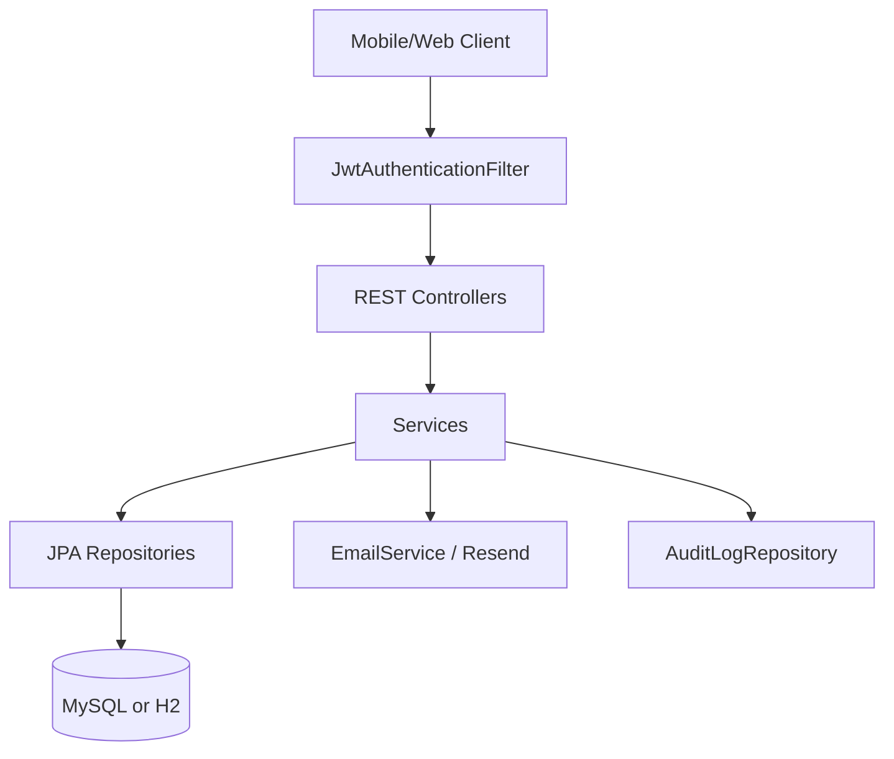
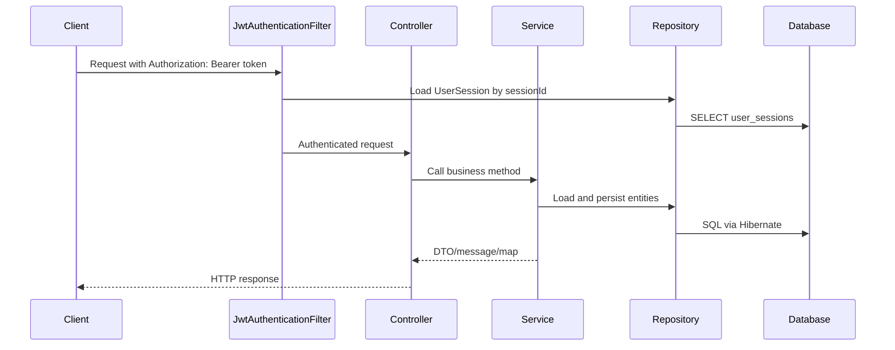

# Architecture

The codebase follows a conventional Spring layered architecture:



## Main Layers

| Layer | Examples | Responsibility |
|---|---|---|
| Controller | `AuthController`, `SessionController`, `StudentController`, `HodController`, `AdminController` | HTTP routing, validation annotations, permission annotations, response shaping. |
| Service | `AuthService`, `SessionService`, `DeviceChangeService`, `DeviceVerificationService`, `RoomService` | Business rules, transactions, audit writes, token/session management. |
| Repository | `UserRepository`, `SessionRepository`, `AttendanceRepository`, etc. | Database access using Spring Data query methods and JPQL queries. |
| Entity | `User`, `Session`, `Attendance`, `Student`, `Teacher`, etc. | JPA mappings, constraints, relationships, lifecycle defaults. |
| Security | `SecurityConfig`, `JwtAuthenticationFilter`, `JwtUtil`, `CustomUserDetailsService` | Stateless JWT auth, role/permission authorities, session revocation checks. |

## Request Flow

```text
HTTP request
  -> SecurityFilterChain
  -> JwtAuthenticationFilter extracts Bearer token
  -> JwtUtil validates signature, expiry, password-change timestamp
  -> UserSessionRepository checks session exists and is not revoked
  -> deviceId claim is compared with UserSession.deviceId when present
  -> Controller method executes
  -> @PreAuthorize checks role/permission authority
  -> Service performs business rules inside @Transactional boundary
  -> Repository reads/writes JPA entities
  -> Controller returns DTO/map/message
  -> GlobalExceptionHandler converts known exceptions to ErrorResponse
```

## Design Patterns And Conventions

| Pattern | Where used |
|---|---|
| DTO pattern | Request/response objects in `dto`, for example `LoginRequest`, `CreateSessionRequest`, `AuthResponse`. |
| Repository pattern | Spring Data JPA interfaces in `repository`. |
| Service layer | Business logic in `AuthService`, `SessionService`, `DeviceChangeService`, etc. |
| Method-level authorization | `@PreAuthorize` expressions in controllers. |
| Token revocation/session table | JWTs contain `sessionId`; `JwtAuthenticationFilter` checks `user_sessions.revoked`. |
| Audit logging | `AuthService` and `SessionService` persist `AuditLog` rows for key actions. |
| Scheduled state transition | `SessionExpiryScheduler` periodically locks/cancels sessions. |

## Core Component Interactions



## Transaction Boundaries

Most write operations are transactional at service level:

| Class | Transaction use |
|---|---|
| `AuthService` | Registration, login, refresh, logout, password reset, role assignment, device reset. |
| `SessionService` | Session lifecycle, attendance marking, report reads, scheduled status changes. |
| `DeviceChangeService` | Device request creation, approval, rejection. |
| `HodController`, `AdminController` | Controller-level `@Transactional`; some business logic is implemented directly in controllers. |

