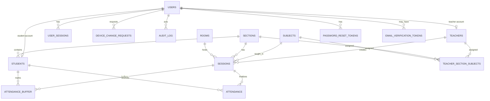

# Database Schema

The schema is generated from JPA entities; no Flyway or Liquibase migrations are present. `spring.jpa.hibernate.ddl-auto` defaults to `update` in the main profile and `create-drop` in the test profile.

## Entity Tables

### `users` (`User`)

| Field | Type | Constraints / notes |
|---|---|---|
| `id` | `Long` | PK, identity |
| `username` | `String` | required, unique, length 50 |
| `email` | `String` | required, unique, length 255 |
| `password` | `String` | required, length 100, BCrypt expected |
| `role` | `Role` enum | required, string enum |
| `enabled` | `boolean` | required, default true |
| `emailVerified` | `boolean` | required, default false |
| `createdAt` | `LocalDateTime` | required, set in `@PrePersist` |
| `lastPasswordChange` | `LocalDateTime` | used to invalidate older JWTs |
| `registeredDeviceId` | `String` | length 255 |
| `is_blocked`, `block_reason`, `blocked_at` | boolean/string/time | legacy blocking fields |
| `failedLoginAttempts` | `int` | required, default 0 |
| `accountLockedUntil` | `LocalDateTime` | temporary lockout |
| `lastLoginAt` | `LocalDateTime` | updated on successful login |

Indexes/constraints: unique username/email, indexes on email, username, registered device ID.

### `students` (`Student`)

| Field | Type | Constraints / notes |
|---|---|---|
| `id` | `Long` | PK |
| `user_id` | `User` | optional one-to-one, unique constraint |
| `student_id` | `String` | required, unique, length 50 |
| `name` | `String` | required, length 100 |
| `email` | `String` | length 255 |
| `section_id` | `Section` | required many-to-one |
| `publicKey` | `String` | text EC public key |

### `teachers` (`Teacher`)

| Field | Type | Constraints / notes |
|---|---|---|
| `id` | `Long` | PK |
| `user_id` | `User` | optional one-to-one, unique constraint |
| `teacher_id` | `String` | required, unique, length 50 |
| `name` | `String` | required, length 100 |
| `email` | `String` | length 255 |
| `mappedSubjects` | many-to-many | join table `teacher_subjects` |
| `mappedSections` | many-to-many | join table `teacher_sections` |

### `sections` (`Section`)

| Field | Type | Constraints / notes |
|---|---|---|
| `id` | `Long` | PK |
| `name` | `String` | required, length 100 |
| `departmentName` | `String` | required, length 100 |

### `subjects` (`Subject`)

| Field | Type | Constraints / notes |
|---|---|---|
| `id` | `Long` | PK |
| `name` | `String` | required, unique, length 100 |
| `mappedSections` | many-to-many | join table `subject_sections`; ignored in JSON |

### `teacher_section_subjects` (`TeacherSectionSubject`)

| Field | Type | Constraints / notes |
|---|---|---|
| `id` | `Long` | PK |
| `teacher_id` | `Teacher` | required many-to-one |
| `section_id` | `Section` | required many-to-one |
| `subject_id` | `Subject` | required many-to-one |

Unique constraint: `(teacher_id, section_id, subject_id)`.

### `rooms` (`Room`)

| Field | Type | Constraints / notes |
|---|---|---|
| `roomNumber` | `String` | PK, required, length 50 |
| `beaconUuid` | `String` | required, unique, length 100 |
| `length` | `double` | must be positive by service validation |
| `width` | `double` | must be positive by service validation |
| `safeRadiusMeters` | `double` | must be positive by service validation |

### `sessions` (`Session`)

| Field | Type | Constraints / notes |
|---|---|---|
| `id` | `Long` | PK |
| `version` | `Long` | optimistic lock field |
| `teacher_id` | `Teacher` | required |
| `subject_id` | `Subject` | required |
| `section_id` | `Section` | required |
| `session_code` | `String` | required, unique, length 6 |
| `room_number` | `Room` | required FK to `rooms.roomNumber` |
| `status` | `SessionStatus` | required enum: `ACTIVE`, `LOCKED`, `APPROVED`, `CANCELLED` |
| `sessionDate` | `LocalDate` | set during creation |
| `startTime`, `expiryTime`, `lockedAt`, `approvedAt`, `cancelledAt` | `LocalDateTime` | lifecycle timestamps |

Indexes: status, session code, `(section_id,status)`.

### `attendance_buffer` (`AttendanceBuffer`)

| Field | Type | Constraints / notes |
|---|---|---|
| `id` | `Long` | PK |
| `version` | `Long` | optimistic lock field |
| `session_id` | `Session` | required |
| `student_id` | `Student` | required |
| `markedAt` | `LocalDateTime` | required, set in `@PrePersist` |
| `markType` | `MarkType` | required enum: `AUTO`, `MANUAL` |

Unique constraint: `(session_id, student_id)`. Index: `session_id`.

### `attendance` (`Attendance`)

| Field | Type | Constraints / notes |
|---|---|---|
| `id` | `Long` | PK |
| `version` | `Long` | optimistic lock field |
| `session_id` | `Session` | required |
| `student_id` | `Student` | required |
| `status` | `AttendanceStatus` | required enum: `PRESENT`, `ABSENT` |
| `markedAt` | `LocalDateTime` | required, set in `@PrePersist` |
| `sessionDate` | `LocalDate` | required, copied from session in `@PrePersist` |

Indexes: student, session, status. There is no unique constraint preventing duplicate final attendance rows for the same session/student.

### `user_sessions` (`UserSession`)

| Field | Type | Constraints / notes |
|---|---|---|
| `id` | `Long` | PK |
| `version` | `Long` | optimistic lock field |
| `user_id` | `User` | required |
| `deviceId` | `String` | length 255 |
| `refreshTokenHash` | `String` | required, length 255 |
| `ipAddress` | `String` | length 100 |
| `userAgent` | `String` | text/default string column |
| `createdAt` | `LocalDateTime` | required, set in `@PrePersist` |
| `lastActiveAt` | `LocalDateTime` | updated on login/refresh |
| `revoked` | `boolean` | required, default false |

Indexes: user, refresh token hash, revoked.

### Token / Audit / Device Tables

| Table | Entity | Key fields |
|---|---|---|
| `email_verification_tokens` | `EmailVerificationToken` | `tokenHash`, optional `user_id`, `collegeId`, `expiryTime`, `used`, `createdAt` |
| `password_reset_tokens` | `PasswordResetToken` | `tokenHash`, required `user_id`, `expiryTime`, `used`, `createdAt` |
| `device_change_requests` | `DeviceChangeRequest` | `user_id`, `oldDeviceId`, `newDeviceId`, `reason`, `status`, `requestedAt`, `resolvedAt`, `resolved_by`, `adminRemarks` |
| `audit_log` | `AuditLog` | `action`, optional `actor_user_id`, `targetEntity`, `targetId`, `timestamp`, `details` |

## ER Diagram

